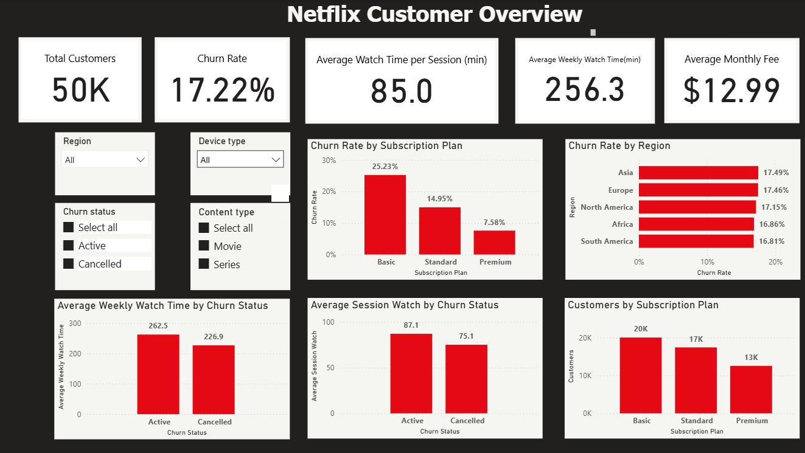
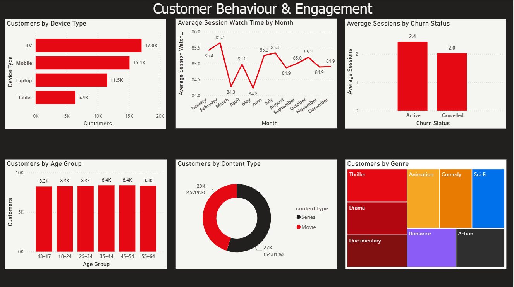
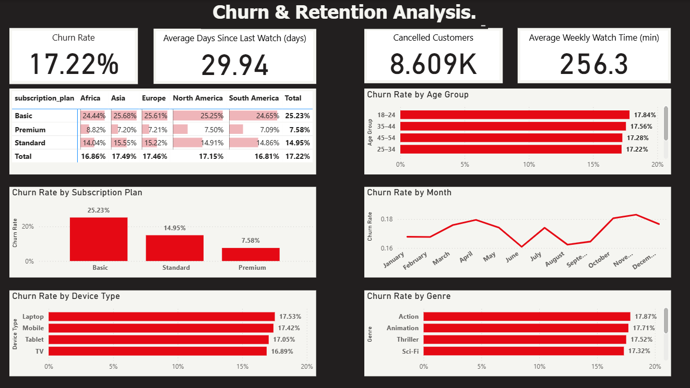

# Netflix Customer Analytics: Behaviour, Churn & Retention

An end-to-end data analytics portfolio project exploring how subscription characteristics and viewing behaviour relate to customer **engagement** and **churn** at a subscription streaming service.

**Tools:** Python (Pandas, Matplotlib, Seaborn) · SQL (SQLite) · Power BI

---

## Table of Contents

1. [Business Problem](#business-problem)
2. [Project Objectives](#project-objectives)
3. [Dataset](#dataset)
4. [Project Workflow](#project-workflow)
5. [Repository Structure](#repository-structure)
6. [Data Cleaning & Quality Findings](#data-cleaning--quality-findings)
7. [Key Findings](#key-findings)
8. [Power BI Dashboard](#power-bi-dashboard)
9. [Recommendations](#recommendations)
10. [Limitations](#limitations)
11. [Next Steps](#next-steps)
12. [How to Run](#how-to-run)

---

## Business Problem

Subscription businesses depend on retention. Every cancellation is lost recurring revenue plus a higher cost to win the customer back. This project treats the dataset as a real retention problem:

> **How do customer behaviour and subscription characteristics influence engagement, retention and subscription value?**

## Project Objectives

- Understand the characteristics of the customer base
- Measure engagement and viewing behaviour
- Compare behaviour across subscription plans
- Identify factors associated with churn
- Identify high-value and at-risk customer segments
- Provide recommendations to improve retention

### KPIs

| KPI | Source column(s) |
| --- | --- |
| Total Customers | `user_id` |
| Churn Rate | `churn_status` |
| Monthly Revenue / Avg Monthly Fee | `monthly_fee` |
| Avg Watch Time | `watch_time_minutes` |
| Avg Weekly Watch Time | `avg_weekly_watch_time` |
| Sessions per User | `session_count` |
| Completion Rate | `completion_percentage` |
| Avg Rating / Like Rate | `rating`, `liked` |
| Avg Days Since Last Watch | `days_since_last_watch` |
| Content Diversity | `content_diversity_score` |

### Stakeholders

Senior Management · Customer Retention · Marketing · Subscription/Pricing · Content · Product

---

## Dataset

**File:** `netflix_large_dataset_cleaned.csv`

| Attribute | Value |
| --- | --- |
| Rows | 50,000 (one row per customer, 50,000 unique `user_id`s) |
| Columns | 29 |
| Missing values | 0 |
| Countries / Regions | 10 countries across 5 regions |
| Plans | Basic ($8.99), Standard ($13.99), Premium ($17.99) |

### Data Dictionary

| Category | Columns |
| --- | --- |
| **Customer / Demographics** | `user_id`, `age_group`, `gender` |
| **Geography** | `country`, `region` |
| **Subscription** | `subscription_plan`, `monthly_fee`, `subscription_start_date`, `subscription_end_date` |
| **Payment & Pricing** | `payment_method`, `discount_applied` |
| **Retention** | `churn_status`, `days_since_last_watch` |
| **Content** | `title`, `content_type`, `genre`, `language`, `release_year` |
| **Behaviour** | `device_type`, `date_watched`, `time_of_day`, `recommendation_source` |
| **Engagement** | `watch_time_minutes`, `session_count`, `completion_percentage`, `rating`, `liked`, `avg_weekly_watch_time`, `content_diversity_score` |

---

## Project Workflow

```
Business Understanding → Data Understanding → Data Cleaning →
Exploratory Data Analysis → SQL Analysis → Power BI Dashboard →
Insights & Recommendations
```

1. **Business understanding:** defined the problem, objectives, KPIs and stakeholders
2. **Data understanding:** profiled shape, types, ranges and uniqueness
3. **Data cleaning:** standardised dates and column names, validated categories, ranges and business logic
4. **EDA:** churn by segment, engagement vs churn, correlations, plan × region heatmap
5. **SQL analysis:** key questions re-run as SQL against the cleaned data (SQLite)
6. **Dashboard:** three-page interactive Power BI report
7. **Recommendations:** evidence-based retention actions

---

## Repository Structure

```
├── data/
│   └── netflix_large_dataset_cleaned.csv
├── notebooks/
│   └── netflix_fixed.ipynb          # cleaning, EDA and SQL analysis
├── dashboard/
│   └── netflix.pbix                 # Power BI report
├── docs/
│   └── document1.docx               # business understanding & data dictionary
├── images/
│   ├── dashboard_overview.png
│   ├── dashboard_behaviour.png
│   └── dashboard_churn.png
├── presentation/
│   └── netflix_customer_analytics.pptx
└── README.md
```

---

## Data Cleaning & Quality Findings

- **No missing values** and **no duplicate rows** were found.
- **Date columns** (`subscription_start_date`, `subscription_end_date`, `date_watched`) were parsed to datetime.
- **Numeric ranges validated:** ratings within 1–5, completion within 0–100, fees positive, diversity score within 0–1, no negative session or watch-time values.
- **Placeholder end date:** `subscription_end_date` is a real date only for **Cancelled** customers. All **Active** customers (41,391) share `2026-02-07`, a snapshot placeholder. It should **not** be used to calculate tenure without separating Active and Cancelled customers. Rows are flagged with `is_placeholder_end_date`.
- **Viewing after subscription end:** 1,824 records have `date_watched` after `subscription_end_date` (1–259 days, median 79). These were **flagged, not deleted**, because the data can't show whether they are errors or reflect a different date definition.
- **`age_group` holds numeric ages** (17–60), not age bands, so it needs binning for segment analysis.

---

## Key Findings

| Metric | Result |
| --- | --- |
| Overall churn rate | **17.22%** (8,609 of 50,000 customers) |
| Churn: Basic | **25.23%** (highest) |
| Churn: Standard | 14.95% |
| Churn: Premium | **7.58%** (lowest) |
| Plan mix | Basic 40.1% · Standard 34.8% · Premium 25.1% |
| Series share of content | 54.81% |
| Top device | TV (34.1%) |

### 1. Subscription plan is strongly associated with churn
Basic subscribers churn at **more than 3× the rate of Premium** subscribers, and Basic is also the largest plan by customer count, so it is the biggest retention opportunity.

### 2. Cancelled customers engage less
| | Active | Cancelled |
| --- | --- | --- |
| Avg watch time (min) | 87.1 | 75.1 |
| Avg sessions | 2.43 | 2.03 |
| Avg weekly watch time (min) | 262.5 | 227.0 |
| Avg completion % | 92.1 | 91.0 |

Lower watch time, fewer sessions and lower weekly viewing line up with cancellation, which makes engagement a candidate early-warning signal.

### 3. Some hypotheses were *not* supported
Being honest about null results matters as much as the positive ones:
- **`days_since_last_watch`** is essentially identical for Active and Cancelled customers (≈29.9 days each), so it did not separate the groups in this dataset.
- **Region, device type, payment method and discount** show only small differences in churn (roughly 16.8%–17.5% across regions and devices; 17.0% vs 17.3% with/without discount).

### Important caveat
These are **associations, not causal effects**. The data can't show that a plan or lower engagement *causes* cancellation.

---

## Power BI Dashboard

`netflix.pbix` contains three interactive pages with slicers for region, device type, churn status and content type.

### 1. Netflix Customer Overview
Headline KPIs (50K customers, 17.22% churn, $12.99 average fee) plus churn and engagement by plan and region.



### 2. Customer Behaviour & Engagement
Device usage, monthly session trends, age groups, content type and genre mix.



### 3. Churn & Retention Analysis
Churn broken down by plan × region, age group, month, device and genre.



---

## Recommendations

1. **Run targeted retention campaigns for Basic subscribers.** They are the largest and highest-churn group.
2. **Test upgrade offers** from Basic to higher tiers, since higher tiers churn far less.
3. **Flag low-engagement customers** (low weekly watch time, few sessions) for personalised re-engagement before they cancel.
4. **Use engagement as an early-warning input** to a churn-risk model.
5. **Keep analysing content preferences.** Series make up the majority of viewing, which can guide personalisation and content investment.

---

## Limitations

- Findings are correlational; no causal claims can be made.
- Each customer has **one** viewing record, so behaviour is a snapshot rather than a time series and pre-cancellation trends can't be observed.
- Active customers' `subscription_end_date` is a placeholder, so tenure and lifetime analysis is limited.
- The dataset appears synthetic (uniform-looking segment differences, generated titles such as "Romance Title 525"), so results should be treated as a portfolio exercise rather than real-world Netflix insight.

## Next Steps

- Build a churn prediction model and customer risk scores
- Cohort and retention-over-time analysis
- Customer lifetime value analysis
- Investigate *why* Basic customers churn more
- Test retention strategies with A/B testing

---

## How to Run

```bash
# 1. Clone the repository
git clone <your-repo-url>
cd <your-repo-name>

# 2. Install dependencies
pip install pandas numpy matplotlib seaborn jupyter

# 3. Launch the notebook
jupyter notebook notebooks/netflix_fixed.ipynb
```

Update the CSV path in the first notebook cells if your folder layout differs. To explore the dashboard, open `dashboard/netflix.pbix` in **Power BI Desktop**.

---

## Author

**Your Name** · [LinkedIn](#) · [GitHub](#) · [Portfolio](#)
